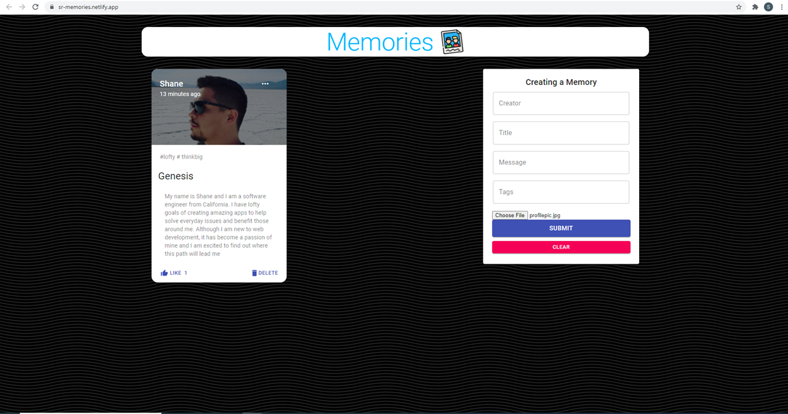

A full-stack MERN project created to add blog posts or "memories" using react, redux, node, express, and mongoDB.
The project allows the user to add posts/photos, delete posts, and edit posts. The app also records how long ago a post was made and has a like button added.

To view the page, please select the link below.

https://sr-memories.netlify.app/

